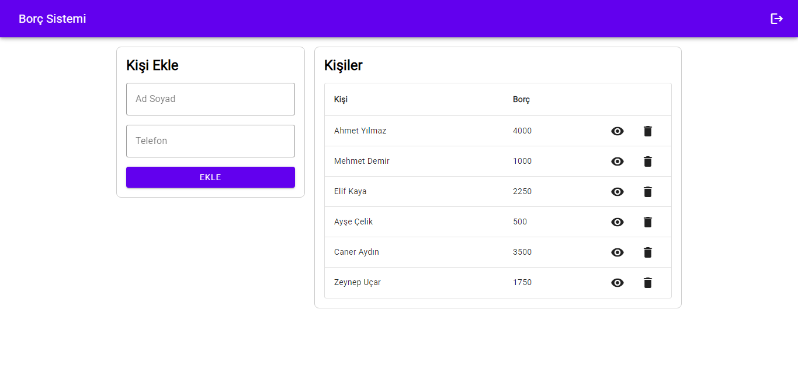
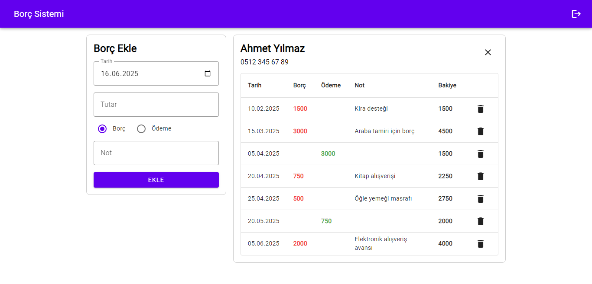

# Web Tabanlı Programlama PHP & MySQL Projesi

## Seçtiğim Proje Konusu
Borç Sistemi

## Proje Açıklaması
Borç verdiğiniz kişileri, ne zaman ne kadar borç verdiğinizi, ne zaman ne kadar ödeme aldığınızı, kimin ne kadar borcu kaldığını takip edebileceğiniz bir sistem.

## Ekran Görüntüleri

---

## Özellikler
- Kaydolma
- Giriş yapma
- Çıkış yapma
- Veri ekleme
- Veri görüntüleme
- Veri güncelleme
- Veri silme

## Yararlanılan Teknolojiler
- PHP
- MySQL
- HTML
- CSS
- Javascript
- Material Components for the Web

## Projede Yararlandığım Yapay Zeka Araçları
- [chatgpt.com](https://chatgpt.com)  
**Kullanım Biçimi:** Kütüphane bileşenlerinin kullanım şekillerini öğrenme.
